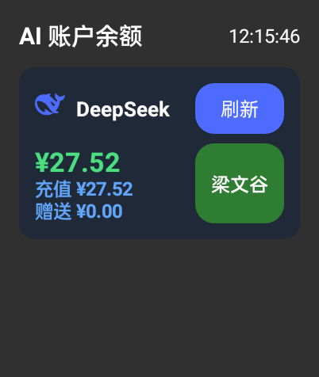

# AIQuotaOW2 · OPPO Watch 2 上的 AI 额度（余额）工具

一款可安装到 **OPPO Watch 2**（国内版 ColorOS Watch，基于 Android 8.1）上的小工具，
通过 **DeepSeek** 的开放接口实时查询账户余额。纯 Java + 系统 API 实现，**零第三方依赖**。

> 工程名：`AIQuotaOW2`（AI Quota · OPPO Watch 2）
> 手表桌面上的应用名：**AI额度**（应用内标题栏为「AI 账户余额」）

## 效果预览



## 功能

- 查询 **DeepSeek** 账户余额（总额 / 充值 / 赠送），适配手表小方屏
- 使用官方 DeepSeek logo 作为卡片图标，品牌蓝（`#4D6BFE`）主题
- 右上角「刷新」按钮：**查询中禁用并显示「查询中…」**，余额区高度保持不变（始终预留两行）
- 深色 UI，省电且适合手表
- **零输入**：API Key 通过 `aibalance_keys.json` 推送到手表，启动时自动载入，无需在手表上打字

## 工作原理

- 查询接口：`GET https://api.deepseek.com/user/balance`
- 鉴权：`Authorization: Bearer <你的 DeepSeek API Key>`
- 解析返回 JSON 中的 `balance_infos[0]`：
  - `total_balance` → 总额
  - `topped_up_balance` → 充值
  - `granted_balance` → 赠送
- 所有请求均为 HTTPS，Key 只通过 `Authorization` 头发送给 DeepSeek 官方域名
- 目前仅 DeepSeek 支持余额查询；用量（token 消耗）DeepSeek 未提供公开 API，故未做

## 从文件载入 Key（零输入）

在电脑上写一个 JSON 文件，把 Key 放进去，再 `adb push` 到手表即可，全程不用在手表上打字。

1. 电脑上创建 `aibalance_keys.json`：

   ```json
   {
     "deepseek": "sk-你的DeepSeekKey"
   }
   ```

2. 推送到手表（**推荐用 App 私有目录，无需任何权限**）：

   ```bash
   adb push aibalance_keys.json \
     /sdcard/Android/data/com.example.aibalance/files/aibalance_keys.json
   ```

   > 兼容路径（需读存储权限）：`/sdcard/Download/aibalance_keys.json`

3. 在手表上打开（或重启）App，启动时会自动读取文件并填入 Key，随后刷新余额。
   之后更换 Key 只需改文件重新 push，再重开 App。

## 构建

> 技术栈：AGP 7.4.2 + Gradle 7.6.3，compileSdk 33，minSdk 26（OPPO Watch 2 基于 Android 8.1）。

### 方式一：Android Studio（推荐）

1. 安装 Android Studio（自带 JDK 17 与 Android SDK）。
2. `File → Open` 选择本项目目录 `AIQuotaOW2`，等待 Gradle Sync 完成
   （首次会自动下载 Gradle 7.6.3 与 AGP 7.4.2，并生成 Gradle Wrapper）。
3. `Build → Build App Bundle(s)/APK(s) → Build APK(s)`，
   产物位于 `app/build/outputs/apk/debug/`，文件名形如 `AIQuotaOW2-v1.0-debug.apk`（项目名-版本号-构建类型）。

### 方式二：命令行（需本地已装 Gradle 7.6.3）

> 注意：仓库附带 `gradle/wrapper/gradle-wrapper.properties`，但**未包含 wrapper 的 jar**。
> 用 Android Studio 打开会自动生成；或在已安装 Gradle 7.6.3 的环境下直接构建：

```bash
# 在项目根目录 AIQuotaOW2 下
gradle assembleDebug
# 或先生成 wrapper 再用 ./gradlew
gradle wrapper --gradle-version 7.6.3
./gradlew assembleDebug
```

产物同样位于 `app/build/outputs/apk/debug/`，文件名形如 `AIQuotaOW2-v1.0-debug.apk`（项目名-版本号-构建类型）。

## 安装到 OPPO Watch 2

1. **手表开启 ADB 调试**
   - `设置 → 关于手表 → 版本号` 连续点击 7 次开启开发者模式；
   - 进入 `设置 → 开发者选项`，打开 **ADB 调试**（可用 USB 或「通过 WLAN 调试」）；
   - 若用 WLAN 调试，记下手表的 IP 与端口（需与电脑同一 Wi-Fi）。

2. **电脑连接手表**（需安装 [ADB 平台工具](https://developer.android.com/tools/releases/platform-tools)）：

   ```bash
   # USB 直连一般自动识别；WLAN 调试则：
   adb connect 192.168.x.x:5555
   adb devices          # 确认设备状态为 device（若 unauthorized 需在手表上点允许）
   ```

3. **安装 APK**：

   ```bash
   adb install -r app/build/outputs/apk/release/AIQuotaOW2-v1.0-release.apk
   ```

4. 在手表应用列表中找到「**AI额度**」，点开即可看到 DeepSeek 余额。

### 显示效果微调（可选）

手表默认 DPI 可能偏大/偏小，可调整（恢复：`adb shell wm density reset`）：

```bash
adb shell wm density 200
```

## 常见问题

- **提示「未设置 API Key」**：把 Key 写入 `aibalance_keys.json` 并 push 到手表，重启 App。
- **HTTP 401 / Invalid Authentication**：Key 错误或已失效，到 platform.deepseek.com 重新生成。
- **网络错误**：手表需能联网（Wi-Fi、蓝牙共享手机网络或 eSIM）。
- **安装时报 `INSTALL_FAILED_OLDER_SDK`**：手表系统 API 低于 26；本项目 minSdk 为 26，
  OPPO Watch 2（Android 8.1）正常支持，出现此错误通常是连接到了其它设备。

## 项目结构

```
AIQuotaOW2/
├── app/
│   └── src/main/
│       ├── java/com/example/aibalance/
│       │   ├── MainActivity.java      # UI、卡片、刷新交互、从文件读 Key
│       │   ├── Provider.java          # 平台配置
│       │   └── BalanceFetcher.java    # 网络请求与 JSON 解析
│       ├── res/
│       │   ├── drawable/              # ic_deepseek(官方logo)、btn_refresh_bg、card_bg
│       │   ├── layout/                # activity_main / item_provider
│       │   └── values/strings.xml     # app_name = AI额度
│       └── AndroidManifest.xml
├── docs/preview.png                   # 效果预览图
├── settings.gradle                    # rootProject.name = AIQuotaOW2
├── build.gradle
└── gradle.properties
```

## 自动发布（GitHub Actions）

push 一个 `v*` 格式的 tag（如 `v1.0.1`）即自动构建**签名** Release APK 并创建 GitHub Release。

需先在仓库 **Settings → Secrets and variables → Actions** 配置以下仓库密钥：

| Secret | 说明 |
|--------|------|
| `KEYSTORE_BASE64` | 本地 `keystore.jks` 的 Base64（单行），生成：`base64 -w0 keystore.jks` |
| `KEYSTORE_PASSWORD` | keystore 密码 |
| `KEY_ALIAS` | 密钥别名（本项目为 `aiQuotaOW2`） |
| `KEY_PASSWORD` | 密钥密码 |

工作流文件见 `.github/workflows/release.yml`。

## 安全说明

- 所有请求均为 HTTPS，API Key 仅通过 `Authorization: Bearer` 头发送给 DeepSeek 官方域名；
- Key 只保存在本机应用私有目录（`SharedPreferences` 与 push 进来的文件）中，卸载即删除；
- 不要把真实 Key 提交进仓库（见 `.gitignore` 中的 `aibalance_keys.json`）。
